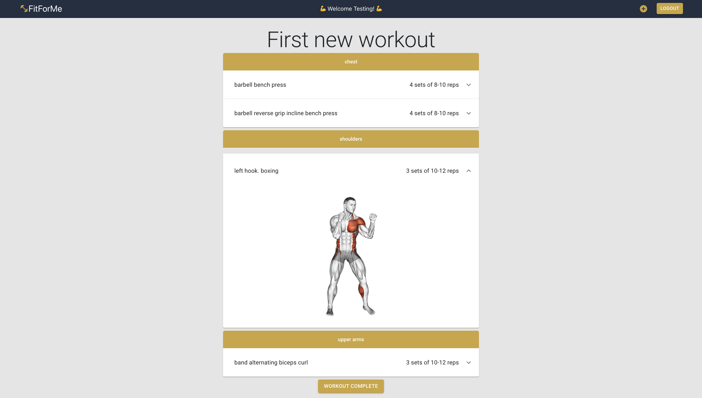
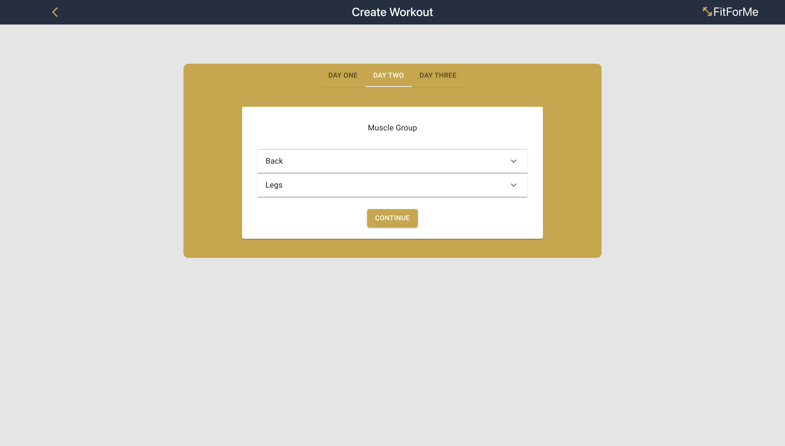
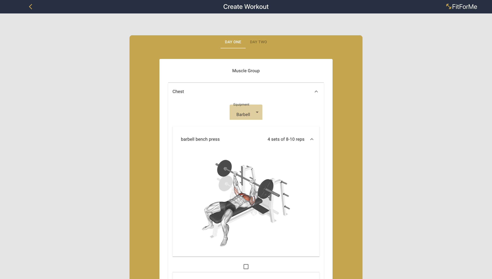
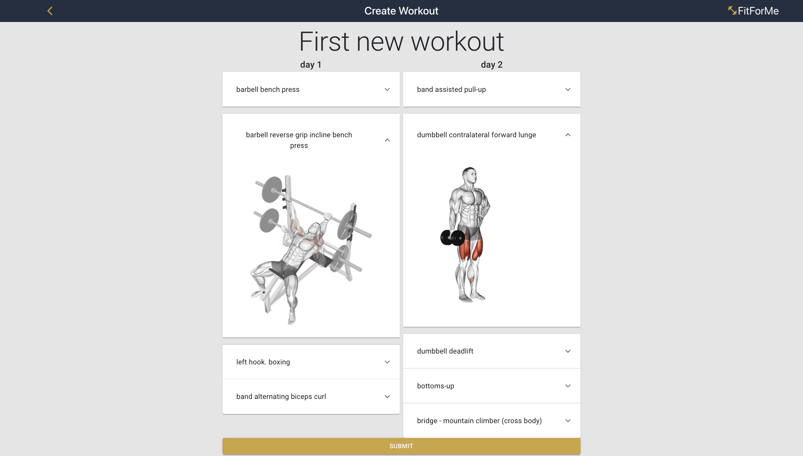

# Fit For Me

A beginners workout application to help with choosing exercices to do based on muscle group.

## Setup
1. Install dependencies with `npm install`
2. Create .env file based on .env.example
3. Get API_KEY from <https://rapidapi.com/justin-WFnsXH_t6/api/exercisedb>
4. Put API_KEY into appropriate .env vars
5. Run `npm start` on the server folder to start application 
7. Visit `http://localhost:8080/`
8. Run `npm start` on the client folder to start application
8. Visit `http://localhost:3001/`

## Dependencies

- Postgres
- Express
- React
- axios
- bcrypt
- Material UI
- React-DOM
- React-Router-DOM